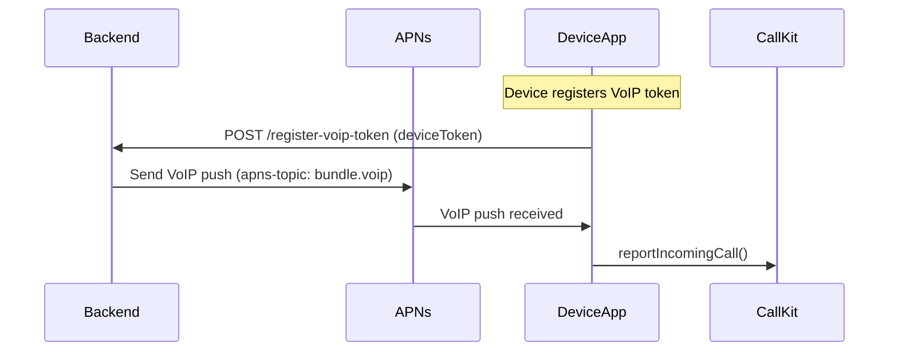
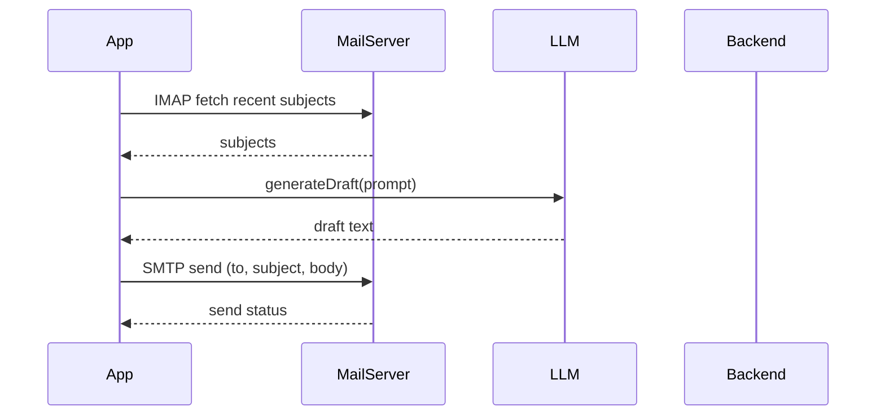
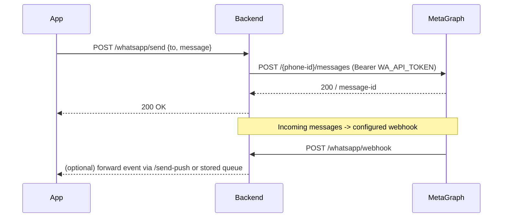

# AST AI - System Architecture (Developer Prototype)

## Purpose
Concise architecture and sequence diagrams for the developer prototype (VoIP, email, calendar, AI replies, WhatsApp + Twilio). Use this as the single-source design for implementation and testing.

## High-level Components
- iOS App (SwiftUI)
  - `PushKitManager.swift`, `CallKitManager.swift`: VoIP registration & call UI
  - `EventKitManager.swift`: Calendar access
  - `EmailAccountSettings.swift`, `MailCoreManager.swift`: IMAP/SMTP
  - `LLMManager.swift`: AI reply engine (local + OpenAI optional)
  - `KeychainHelper.swift`: secure secrets
  - `SIPProviderManager.swift`: client to backend for Twilio/WhatsApp actions
- Backend (Node.js/Express) - `backend/server.js`
  - APNs JWT + VoIP push sender
  - Twilio call endpoints
  - WhatsApp Business send + webhook receiver
  - Minimal device token store (prototype)

## Deployment Assumptions (Developer)
- Backend runs on a reachable HTTPS endpoint (or `http://localhost` for local testing).
- Apple developer account + App ID with Push Notifications and VoIP entitlements for device tests.
- Meta/WhatsApp Business account with `PHONE_NUMBER_ID` and `API_TOKEN` for sending messages.
- Twilio account for voice flows (optional for calls).

## Sequence Diagrams

### VoIP Incoming (high-level)

### Email Fetch / AI Reply / Send

### WhatsApp Send & Webhook

## Data Flows & Privacy (summary)
- Sensitive items stored in Keychain on device: email password, OpenAI key.
- Backend must never commit secrets; use environment variables for APNS/TWILIO/WA keys.
- Logs must never include full device tokens, API keys, or user email passwords.
- WhatsApp messages handled by the backend; personal phone numbers are processed and transmitted only as needed to Meta API.

## Backend Endpoints (prototype)
- `POST /register-voip-token` -> store token
- `POST /send-voip-push` -> trigger APNs voip push
- `POST /twilio/make-call` -> initiate Twilio call
- `POST /whatsapp/send` -> send WhatsApp text
- `GET /whatsapp/webhook` -> verification
- `POST /whatsapp/webhook` -> incoming message receiver

## Infra & Provisioning Checklist
- [ ] Apple Developer: create App ID, enable Push Notifications & VoIP
- [ ] Generate APNs AuthKey (.p8), set `APNS_AUTH_KEY_PATH` and env vars
- [ ] Configure Push certificate topics (`<bundle>.voip`)
- [ ] Obtain WhatsApp Business `PHONE_NUMBER_ID` and `API_TOKEN`
- [ ] Set webhook URL in Meta Business Manager to `GET /whatsapp/webhook` endpoint
- [ ] Create Twilio credentials (if using Twilio)

## Next Steps
- Specify detailed data flow diagrams per-user and privacy-preserving storage design (session caching, server-side token rotation).
- Implement webhook forwarding to device (push on incoming WhatsApp) or provide an in-app polling option for prototype.

---

Created for developer prototype testing. Contact the code owners to add production-grade auth, validation, and rate-limiting before public release.
